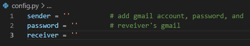
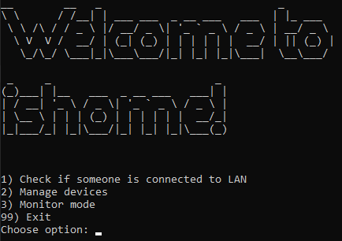

<h1 align = "center">ishome</h1>

## Description

This project provides a way of knowing if a specific device is connected to the LAN, which means the device is physically in a place of interest.  Knowing if a cell phone is inside the network could be a way of knowing if a specific person is physically in that place (like a house ).

## Dependencies

* Python 3
* It has only been tested on Windows 10
* Tried to implement it on a raspberry pi 4 B and had multiple errors, still could be a very interesting tool if you are able to make it work.

## Installing

* Download zip file and excract its content into the directory you want to store this tool.
* Or simply clone this repository into where you want to store it.

## Steps

* Once inside the project directory, install python3 requirements using requirements.txt file or run pipreqs in order to get the missing requirements.
### 1) Edit config.py
 You will need to edit the config.py file. Insert:
 * The gmail account that will be sending the periodic report. (Make a new gmail account or use a disposable one). [How to enable a gmail account to work with python](https://www.dev2qa.com/how-do-i-enable-less-secure-apps-on-gmail/)
 * The password for that account.
 * Your main gmail address where you'll get the reports. 

### 2) Get the ip address(es) of the device(s)
You can scan the network in the search for a specific device, or...
In order to know the ip address of:
- Windows machine: "ipconfig" command 
- Unix-like machine (Debian, Arch,etc): "ifconfig" command
- Cell phone:  Inside the wifi options, search for the ip address.  If the device is an iphone, go to settings, wifi, tap on the network it's connected to, scroll down and there will be the ip address.

### 2) Run ishome.py (python3)

Take into account that the PC running this program will have to be inside the same network that the monitored device(s), since it pings their local addresses.

3 main options will be displayed, first of all, you have to add one or more devices you want to keep an eye on.

### 3) Manage devices
Choose the second option, type if you want to add or delete a device, if its the first time you run the tool there will be no devices stored. Provide the name and the ip address.  If you choose to delete a device, simply provide its name.

You can store multiple devices, which will be printed once you choose to manage devices again.

### - Check if someone is connected to LAN
The stored devices will be displayed, type the name of the device you want to ping and wait for a response.

### - Monitor mode

Provide the name(s) of the device(s) and choose the required parameters in order for the monitoring process to start.

## Disclaimer

This piece of software is intended for EDUCATIONAL PURPOSES ONLY and MUST NOT be used with malicious intentions.  Remember a project of this kind must only be used on your own devices or those whose owner has given you express consent to try this piece of software on.  Allways in a controlled environment!

Any misuse or damage caused by this information is not the responsibility of the repository owner. 